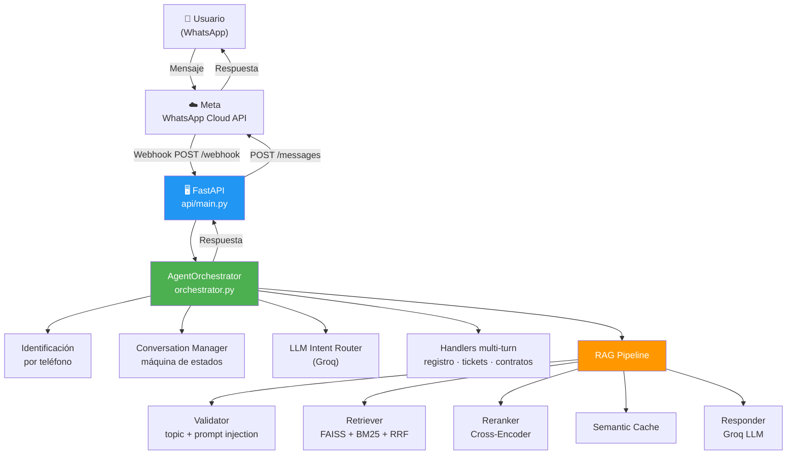

# KnowLigo - RAG-Powered IT Support Agent

**Proyecto educativo**: Agente conversacional de soporte IT para WhatsApp con RAG, flujos multi-turn y gestión transaccional, usando FAISS, Groq LLM y SQLite.

[](https://python.org)
[](https://fastapi.tiangolo.com)
[](tests/)
[](LICENSE)

## � Documentación

| Documento | Audiencia | Descripción |
|-----------|-----------|-------------|
| [AGENTS.md](AGENTS.md) | 🤖 AI Agents | Contexto completo para coding agents — arquitectura, reglas, patrones |
| [docs/INDEX.md](docs/INDEX.md) | 👤 Todos | Índice principal de toda la documentación |
| [docs/diagrams/](docs/diagrams/architecture.md) | 👤 Todos | Diagramas Mermaid — C4, ERD, pipeline RAG, máquina de estados |
| [docs/adr/](docs/adr/) | 🏗️ Arquitectos | Decisiones arquitectónicas (SQLite, FAISS+BM25, Groq, webhook) |
| [docs/PRD.md](docs/PRD.md) | 📋 Product | Product Requirements Document completo |
| [llms.txt](llms.txt) | 🤖 AI Agents | Índice legible por máquina (estándar llms.txt) |

## 📋 Descripción

### Stack Tecnológico

| Categoría | Tecnología | Versión | Propósito |
|-----------|-----------|---------|-----------|
| **Runtime** | Python | 3.11+ | Lenguaje principal |
| **Web Framework** | FastAPI | 0.115.0 | API REST + webhook WhatsApp |
| **Validation** | Pydantic | 2.9.2 | Schemas, settings, DTOs |
| **LLM** | Groq API | 0.11.0 | Llama 3.3 70B Versatile (free tier) |
| **Vector Search** | FAISS (cpu) | 1.13.2 | Búsqueda semántica densa |
| **Sparse Search** | rank-bm25 | 0.2.2 | Búsqueda léxica BM25 |
| **Embeddings** | Sentence Transformers | 3.3.1 | `paraphrase-multilingual-MiniLM-L12-v2` (384-dim) |
| **Reranking** | Cross-Encoder | 3.3.1 | `ms-marco-MiniLM-L-6-v2` |
| **Database** | SQLite | 3 (built-in) | Datos transaccionales |
| **HTTP Client** | httpx | 0.27.2 | WhatsApp Cloud API calls |
| **Deployment** | Docker + Compose | — | Containerización |
| **Testing** | pytest | 8.3.5 | 145 tests (unit + integration) |

KnowLigo es una empresa ficticia de soporte IT para PyMEs. Este proyecto implementa un agente conversacional que:

- ✅ **Identifica clientes** automáticamente por número de teléfono
- ✅ **Registra nuevos usuarios** mediante flujo multi-turn (nombre, empresa, email)
- ✅ Responde consultas sobre **planes de servicio**, **SLAs**, **mantenimiento** y **tickets** usando **RAG**
- ✅ **Crea tickets de soporte** de manera conversacional (asunto, descripción, prioridad)
- ✅ **Contrata planes** con selección, confirmación y pago mock
- ✅ Muestra **estado de cuenta** y **tickets abiertos** del cliente
- ✅ Genera respuestas naturales con **Groq API** (Llama 3.3 70B)
- ✅ Integra con **WhatsApp Business API** vía webhook directo en FastAPI
- ✅ **UI interactiva de WhatsApp** con menús (Interactive Lists) y botones (Reply Buttons)
- ✅ Controla respuestas on-topic, rate limiting y abuse prevention
- ✅ 100% gratuito (usa APIs free tier)

## 🏗️ Arquitectura



> 📐 Diagramas detallados (C4, ERD, pipeline RAG, máquina de estados) en [docs/diagrams/architecture.md](docs/diagrams/architecture.md)

## 🚀 Quick Start

### 1. Requisitos previos

- Python 3.11+
- Docker & Docker Compose
- Cuenta en [Groq](https://console.groq.com) (gratis)
- Cuenta en [Meta for Developers](https://developers.facebook.com) (para WhatsApp)

### 2. Instalación

```powershell
# Clonar repositorio
git clone https://github.com/tu-usuario/knowligo.git
cd knowligo

# Crear entorno virtual
python -m venv .venv
.\.venv\Scripts\Activate.ps1

# Instalar dependencias
pip install -r requirements.txt

# Configurar variables de entorno
Copy-Item .env.example .env
# Edita .env y agrega tu GROQ_API_KEY
```

### 3. Inicializar base de datos y vectorizar documentos

```powershell
# Crear base de datos SQLite
python scripts\utils\init_db.py

# Vectorizar documentos (crear índice FAISS)
python rag\ingest\build_index.py
```

### 4. Ejecutar API localmente

```powershell
# Iniciar API FastAPI
python api\main.py

# En otra terminal, probar
python scripts\test_api.py
```

Abre http://localhost:8000/docs para ver la documentación interactiva.

### 5. Desplegar con Docker

```powershell
# Opción A: Quick Start (todo automático)
python scripts\quick_start.py

# Opción B: Manual
docker-compose up -d

# Ver logs
docker-compose logs -f
```

### 6. Validar instalación

```powershell
# Ejecuta validación completa del sistema
python scripts\validate_demo.py

# Revisa que todos los checks pasen ✅
# Si algo falla, sigue las instrucciones de cada sección
```

## 📁 Estructura del Proyecto

```
knowligo/
├── agent/                  # Agente conversacional
│   ├── orchestrator.py    # Orquestador principal (entry point)
│   ├── router.py          # Clasificación de intención con LLM
│   ├── handlers.py        # Lógica de flujos multi-turn
│   ├── messages.py        # Mensajes interactivos WhatsApp (List, Buttons)
│   ├── conversation.py    # Máquina de estados por teléfono
│   └── db_service.py      # Capa de acceso a datos
├── api/                    # FastAPI application
│   ├── main.py            # Endpoints REST + webhook WhatsApp
│   ├── models.py          # Pydantic schemas
│   └── config.py          # Configuración centralizada (BaseSettings)
├── rag/
│   ├── ingest/            # Pipeline de vectorización
│   │   ├── build_index.py # Crear índice FAISS
│   │   └── chunker.py     # Procesamiento de documentos
│   ├── query/             # Pipeline de consultas RAG
│   │   ├── pipeline.py    # Orquestador RAG
│   │   ├── validator.py   # Control de dominio + prompt injection
│   │   ├── retriever.py   # Búsqueda vectorial FAISS
│   │   ├── responder.py   # Generación LLM (Groq)
│   │   ├── intent.py      # Clasificación de intención (keywords)
│   │   ├── reranker.py    # Cross-Encoder reranking
│   │   └── cache.py       # Caché semántico
│   └── store/             # Índices y chunks
│       ├── faiss.index    # Índice vectorial
│       ├── chunks.pkl     # Chunks procesados
│       └── metadata.json  # Metadata del índice
├── knowledge/             # Base de conocimiento
│   ├── documents/         # Documentos markdown
│   └── metadata.json      # Topics permitidos/prohibidos
├── database/
│   ├── schema/            # Schema SQL (plans, clients, contracts,
│   │                      #   tickets, conversations, payments)
│   ├── seeds/             # Datos de prueba
│   └── sqlite/            # Base de datos
├── tests/                 # Tests con pytest (145 tests)
│   ├── test_api.py        # Tests de endpoints FastAPI
│   ├── test_orchestrator.py # Tests del agente (flujos completos)
│   ├── test_messages.py   # Tests de mensajes interactivos WhatsApp
│   ├── test_db_service.py # Tests de capa de datos
│   ├── test_conversation.py # Tests de máquina de estados
│   ├── test_intent.py     # Tests de clasificación
│   ├── test_models.py     # Tests de schemas Pydantic
│   └── test_validator.py  # Tests de validación
├── scripts/
│   ├── test_api.py        # Tests funcionales manuales
│   ├── validate_demo.py   # Validación del sistema
│   ├── quick_start.py     # Inicio rápido de servicios
│   ├── start.ps1          # Script PowerShell interactivo
│   └── utils/             # Utilidades (init_db.py)
├── docker-compose.yml     # Orquestación de servicios
├── Dockerfile             # Imagen de la API
└── requirements.txt       # Dependencias Python
```

## 🔧 Configuración de WhatsApp

### Opción A: WhatsApp Cloud API (Recomendado - Gratis)

1. **Crear app en Meta for Developers**:
   - https://developers.facebook.com/apps
   - Agrega producto **WhatsApp**
   - Obtén `Phone Number ID` y `Access Token`

2. **Configurar Webhook**:
   - URL: `https://tu-dominio.com/webhook`
   - Verify Token: `knowligo_webhook_2026`
   - Fields: `messages`

3. **Para desarrollo local, usa ngrok**:
   ```bash
   ngrok http 8000
   ```
   Usa la URL HTTPS como Callback URL en Meta.

### Opción B: Solo API (sin WhatsApp)

Usa la API directamente:

```powershell
curl -X POST http://localhost:8000/query `
  -H "Content-Type: application/json" `
  -d '{"user_id":"test","message":"¿Qué planes ofrecen?"}'
```

## 🧪 Testing

### Tests unitarios con pytest

```powershell
# Ejecutar todos los tests (145 tests)
python -m pytest tests/ -v

# Tests específicos
python -m pytest tests/test_api.py -v
python -m pytest tests/test_orchestrator.py -v
python -m pytest tests/test_db_service.py -v
python -m pytest tests/test_conversation.py -v
python -m pytest tests/test_validator.py -v
```

### Test funcional del pipeline

```powershell
# Requiere API corriendo
python scripts\test_api.py
```

Prueba queries de ejemplo:
- "¿Qué planes de soporte ofrecen?" → Intent: VER_PLANES
- "¿Cuál es el SLA para tickets High?" → Intent: CONSULTA_RAG
- "Quiero crear un ticket" → Flujo multi-turn de creación
- "Dame consejos de hacking" → Rechazado (fuera de dominio)

## 📊 Endpoints de la API

### `POST /query`
Procesa una consulta del usuario.

**Request:**
```json
{
  "user_id": "+5491112345678",
  "message": "¿Qué planes ofrecen?"
}
```

**Response:**
```json
{
  "success": true,
  "response": "KnowLigo ofrece tres planes: Basic ($199/mes), Professional ($499/mes) y Enterprise (personalizado)...",
  "intent": "planes",
  "intent_confidence": 0.95,
  "sources": [
    {"file": "plans.md", "section": "Planes", "score": 0.23}
  ],
  "tokens_used": 142,
  "processing_time": 1.25
}
```

### `GET /health`
Verifica el estado del sistema.

### `GET /stats`
Estadísticas de uso (queries procesadas, intents, etc.).

## 🛡️ Controles y Limitaciones

### Topic Validation
- Solo responde consultas sobre: **soporte IT, planes, SLA, tickets, mantenimiento**
- Rechaza: hacking, política, opiniones personales, topics no relacionados

### Rate Limiting
- Máximo **15 queries por usuario por hora**
- Configurable en `.env` (`MAX_QUERIES_PER_HOUR`)

### Response Control
- Máximo **150 palabras** por respuesta
- Tono **profesional, conciso, serio**
- Solo usa información de la base de conocimiento

## 🔐 Variables de Entorno

Edita `.env` con tus credenciales:

```bash
# Groq API (https://console.groq.com/keys)
GROQ_API_KEY=gsk_xxxxxxxxxxxxx

# WhatsApp Business Cloud API
WHATSAPP_TOKEN=EAAxxxxxxxxxxxxx
WHATSAPP_PHONE_NUMBER_ID=123456789012345
WHATSAPP_VERIFY_TOKEN=knowligo_webhook_2026

# Configuración
MAX_MESSAGE_LENGTH=300
MAX_QUERIES_PER_HOUR=30
LLM_MODEL=llama-3.3-70b-versatile
```

## 📈 Roadmap

- [x] Pipeline RAG con FAISS
- [x] Integración Groq LLM
- [x] API REST con FastAPI
- [x] Validación de dominio y rate limiting
- [x] Webhook WhatsApp directo en FastAPI
- [x] Docker compose
- [x] Embeddings multilingüe + Cross-Encoder reranking
- [x] Caché semántico + Protección contra prompt injection
- [x] **Agente conversacional con flujos multi-turn**
- [x] **Identificación de clientes por teléfono**
- [x] **Registro de usuarios, creación de tickets, contratación de planes**
- [x] **Pagos mock y sistema de contratos**
- [x] **LLM Router para clasificación de intenciones**
- [x] Tests unitarios con pytest (145 tests)
- [ ] Monitoreo con Prometheus/Grafana
- [ ] Frontend web para administración
- [ ] Soporte para múltiples idiomas

## 🤝 Contribuir

Este es un proyecto educativo. Pull requests son bienvenidos.

## 📄 Licencia

MIT License - Proyecto educativo de código abierto

## 👤 Autor

**Facundo Nicolás González**

---

⭐ Si este proyecto te fue útil, dale una star en GitHub!
