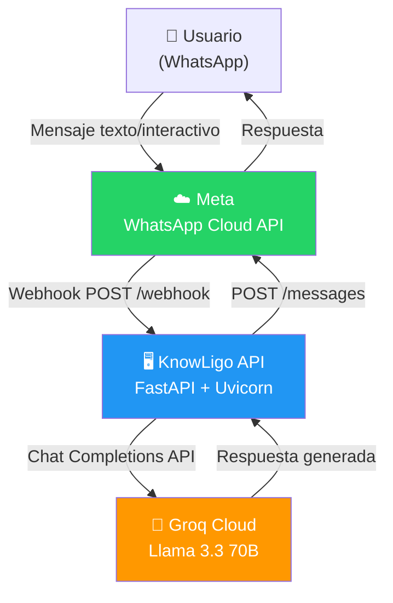
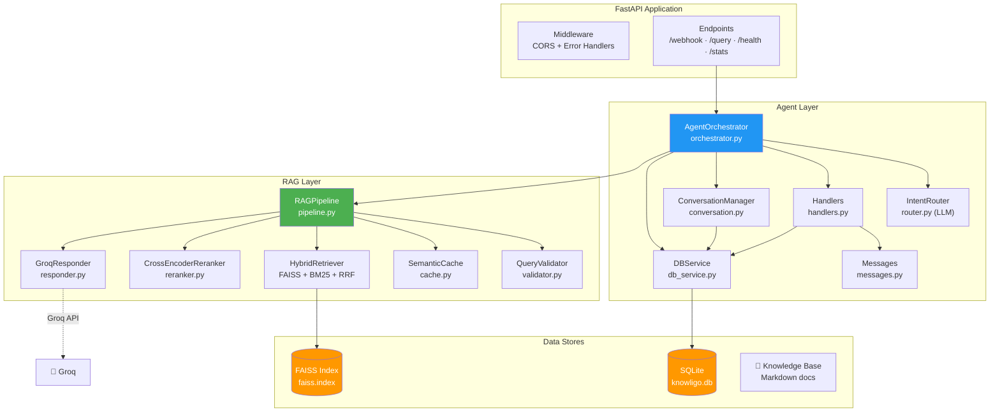
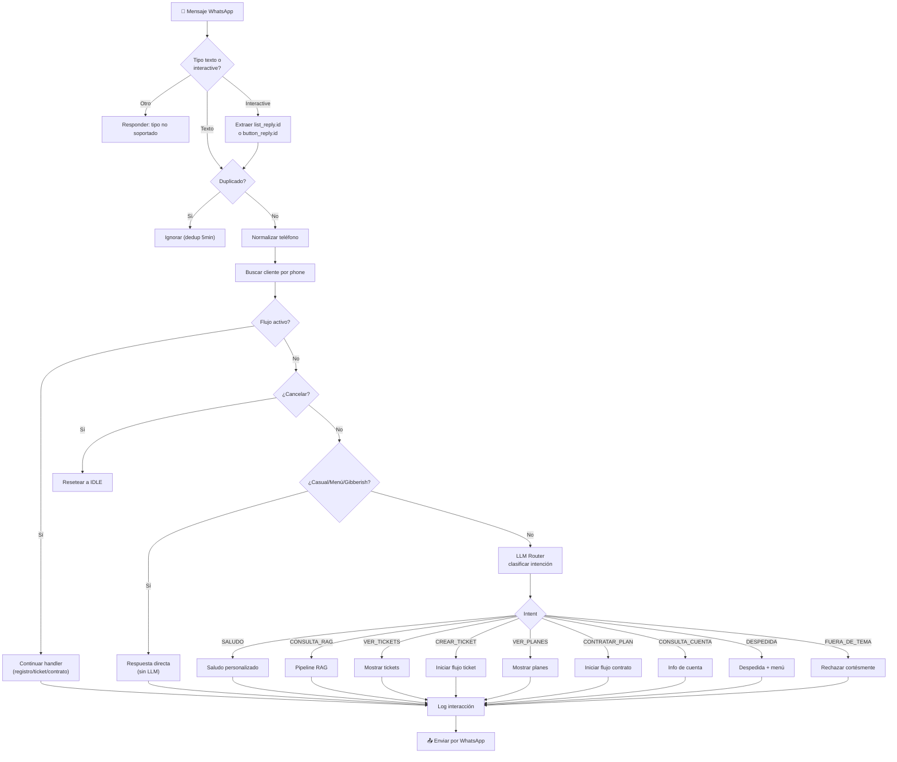
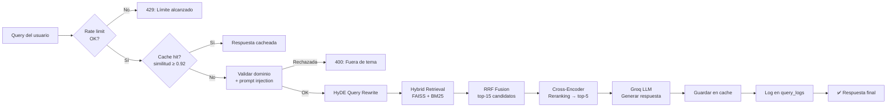
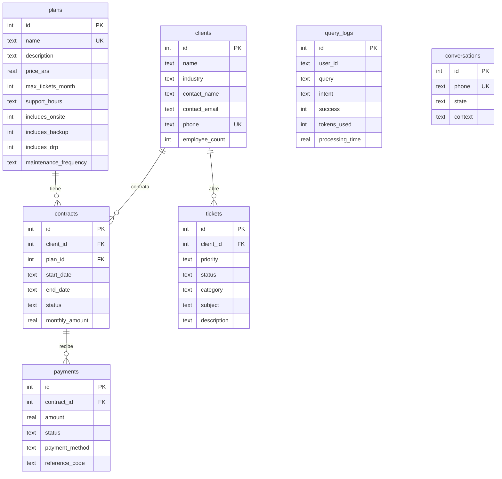
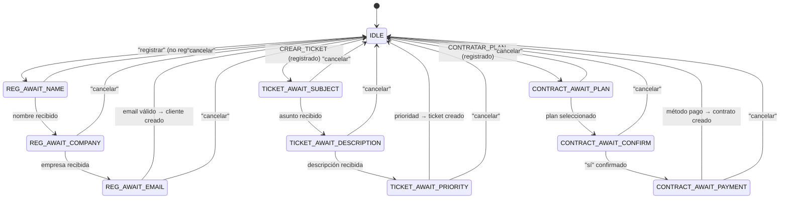

# Diagramas de Arquitectura — KnowLigo

Todos los diagramas usan [Mermaid.js](https://mermaid.js.org/) y se renderizan automáticamente en GitHub, VS Code y cualquier visor Markdown moderno.

---

## 1. Arquitectura General (C4 — Nivel Contexto)

---

## 2. Arquitectura Interna (C4 — Nivel Contenedores)

---

## 3. Flujo de Procesamiento de Mensajes

---

## 4. Pipeline RAG (Detalle)

---

## 5. Diagrama Entidad-Relación (ERD)

---

## 6. Máquina de Estados (Conversación)

